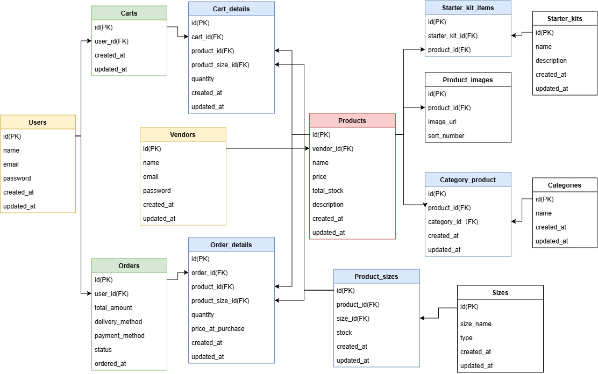

# School-kit-app 保護者向け学校備品購入アプリ

学校で必要な備品や教材を保護者が購入することを目的にしたLaravelプロジェクトです。
商品単品の購入だけでなく、スターターキットをまとめて購入でき、不要な商品はキットから除外することもできます。
教材費の回収や会計管理などの教員の事務負担軽減にも役に立ちます。

## 作成者

en6113

## 使用技術

### 🛠️ バックエンド
- PHP 8.2.x
- Laravel 10.x
  - Laravel Breeze (認証機能)

### 💻 フロントエンド
- Blade(テンプレートエンジン)
- Tailwind CSS 3.4
- Vite（ビルドツール）

### 🗄️ データベース
- MySQL 8.4

### 🐳 インフラ / 開発環境
- Docker / Docker Compose
- Nginx (Webサーバー)
- phpMyAdmin (データベース管理ツール)

## ER図



## 動作環境

- Docker
- Docker Compose

※ Windowsの場合はWSL2の利用を推奨します。

## 環境構築手順

1. **リポジトリのクローン**

    ```bash
    git clone git@github.com:en6113/school-kit-app.git
    ```

2. **.envファイルの準備**

    `.env.example` をコピーして `.env` を作成します。

    ```bash
    cp .env.example .env
    ```

    `.env` ファイル内の以下のDB接続情報が以下と一致していることを確認してください。

    ```ini
    DB_CONNECTION=mysql
    DB_HOST=mysql
    DB_PORT=3306
    DB_DATABASE=laravel
    DB_USERNAME=sail
    DB_PASSWORD=password
    ```

3. **Composer依存パッケージのインストール**

    プロジェクトの初回セットアップ時は、`vendor` ディレクトリが存在しないため `sail` コマンドを使用できません。
    以下のDockerコマンドを実行して、コンテナ内で `composer install` を実行します。

    ```bash
    docker run --rm \
    -u "$(id -u):$(id -g)" \
    -v "$(pwd):/var/www/html" \
    -w /var/www/html \
    -e COMPOSER_CACHE_DIR=/tmp/composer_cache \
    laravelsail/php82-composer:latest \
    composer install
    ```

4. **Laravel Sailの起動**

    以下のコマンドでDockerコンテナを起動します。

    ```bash
    ./vendor/bin/sail up -d
    ```

5. **エイリアスの設定**

    ```bash
    alias sail='[ -f sail ] && bash sail || bash vendor/bin/sail'
    ```

6. **アプリケーションキーの生成**

    ```bash
    sail artisan key:generate
    ```

7. **データベースのマイグレーションと初期データ投入**

    以下のコマンドでテーブルを作成し、ダミーデータを投入します。

    ```bash
    sail artisan migrate:fresh --seed
    ```
    このコマンドの入力後、コンテナ内にデータが残っており、エラーが生じているケースなどがあります。
    その場合は、以下のコマンドを順に実行して各コンテナを再起動して下さい。
    ```bash
    sail down -v
    sail up -d
    sail artisan migrate:fresh --seed
    ```

8. **フロントエンドの準備**

    ```bash
    sail npm install
    sail npm run dev
    ```

    `npm run dev` は開発中は起動したままにしてください。

9. **アプリケーションへのアクセス**

    ブラウザで [http://localhost](http://localhost) にアクセスします。

## 開発環境URL

http://localhost

## 機能一覧

本アプリには以下の3つのユーザーロールがあります。

| ロール | 説明 |
| --- | --- |
| 管理者 | キット・カテゴリーの管理 |
| 一般ユーザー（保護者） | 商品・キットの購入、注文管理 |
| 業者 | 商品・在庫の登録管理 |

### 👨‍👩‍👧‍👦共有機能
#### アカウント機能
- ユーザー登録 / ログイン / ログアウト(Laravel Breeze)
#### 商品一覧表示機能
- 商品一覧表示(カテゴリ絞り込み) / 詳細表示
- キット一覧表示 / 詳細表示

### 🛡️管理者向け機能
#### キット管理機能
- キット登録 / 編集 / 削除
#### カテゴリー管理機能
- カテゴリー一覧表示 / 登録 / 編集 / 削除

### 👤一般ユーザー向け機能
#### 商品購入機能
- 商品をカートに追加
- キットをカートに追加
#### カート管理機能
- カート一覧表示 / 削除
- 注文確定確認画面表示
#### 注文履歴管理機能
- 注文一覧表示 / 詳細表示 / キャンセル（準備中の場合のみ）

### 🏢業者向け機能
#### 商品登録機能
- 商品登録 / 編集 / 削除
#### 在庫管理機能
- 在庫数の登録 / 更新
